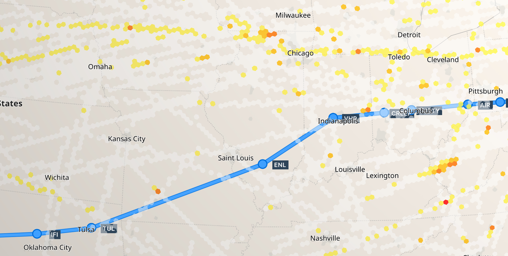

## Quick Start Guide

#### 1. Install

The SkyPath iOS SDK is provided as a pre-built .xcframework file.<br>
Use [Requirements](/README.md#requirements) and [Installation](/README.md#installation) sections instructions to add SkyPath iOS SDK to the project.<br>
Also, see [Documentation](/README.md) for a complete API reference.

Add `import SkyPathSDK`.

#### 2. Setup Delegate

Implement `SkyPathDelegate` methods to get notified when new data has been received from the server. This will be a good place to query for turbulence data and update layer on the map. Below are provided the minimum required methods for the quick start.

```swift
extension Controller: SkyPathDelegate {

    func didUpdateRecordingStatus(to recording: Bool) {
    
        if recording {
            print("SkyPath did start recording")
        } else {
            print("SkyPath did stop recording")
            
            // Call `start()` again to continue recording if needed.
        }		
    }
    
    func didReceiveNewTurbulenceData() {
    
        print("SkyPath did receive new turbulence data")

        // Query for the updated turbulence and show on the map. 
        // See `Get Turbulence` section of this guide.
    }
    
    func didFailToFetchNewData(with error: SPError) {
   	
        print("SkyPath did fail to fetch new data with error: " + error.localizedDescription)
    }
    
    func didChangeDevicePosition(_ inPosition: Bool, horizontal: Bool) {
    
        print("SkyPath device is \(inPosition ? "" : "not ")in position and \(horizontal ? "" : "not ")horizontal")
        
        // Turbulence data is not tracked when device in not in position or is horizontal. 
        // Consider to show a notice here to properly position device in the cradle.
    }
}
```

Set your `SkyPathDelegate` object.

```swift
SkyPath.shared.delegate = delegate
```

#### 3. Configure Data

SkyPath uses [H3](https://h3geo.org) hexagonal hierarchical geospatial indexing system to represent turbulence area by hexagons of different severity level.


	
The SDK is offline first. All tracked turbulence data is storred offline until successfully sent to the server and the fetched data from the server is storred on the disk and accessible offline according to the description below. All configurations like `dataQuery`, `flight` etc are storred on the disk and stay across app launches until explicit change.
	
There are thousands of turbulence reports around the globe. To reduce network traffic usage and keep only data that is currently needed the data fetch is separated in the different types controlled by the `SkyPath.shared.dataQuery` object that is set initially to default values and can be updated at any time. All of the below are optional to set, but recommended due to your specific flow.

- Global turbulence polygons. A planet wide aggregated turbulence area polygons as a GeoJSON string. Used to show turbulence area worldwide without fetching too much data. Can be turned off, enabled by default. Storred on disk, accessible offline.

	```swift
	SkyPath.shared.dataQuery.globalEnabled = false
	```
	Turbulence polygons are generated per time history separately and by default only selected time history is fetched for polygons. To enable fetching polygons for all time histories up to selected set a corresponding flag. For example if set to fetch 4h, then to have polygons available offline for 0.5h, 1h, 2h and 4h you need to set this flag to `true`.
	
	```swift
	SkyPath.shared.dataQuery.globalTurbulencePolygonsUpToEnabled = false
	```
	SDK periodically fetches global turbulence polygons and calls the delegate method when received a new data.
	
	```swift
	// SkyPathDelegate
	func didReceiveNewTurbulencePolygons() { }
	```
	

- Polygon. Geo fence area to fetch data inside only. Route line coordinates can be used to create a polygon that includes the route with radius distance. It is fetched separately from other data types and as fast as possible, and also stored offline. It is not recommended to set a worldwide polygon, use global turbulence polygons for it instead. Storred on disk, accessible offline.

	```swift
	let polygon: [CLLocationCoordinate2D] = []
	SkyPath.shared.dataQuery.polygon = polygon
	```
	
	
- Viewport. A polygon of a visible map area in the app to fetch the right data when it's needed. Please keep in mind, that the SDK will try to fetch the data for the viewport as soon as possible after updating `SkyPath.shared.dataQuery.viewport`. So to save network traffic consider updating `viewport` when it's actually needed. A good place could be when the pilot moved the map manually, released the finger and map stopped moving after animation, or when focused map area is moved by code far from previous focused area. Storred in memory, accessible offline until app relaunch. The previous viewport data is replaced with a new viewport data.

	```swift
	let polygon: [CLLocationCoordinate2D] = []
	SkyPath.shared.dataQuery.viewport = polygon
	```
	

Set `DataHistoryTime` to fetch data for. It's en enum with cases: `halfHour`, `hour`, `twoHours`, `fourHours`, `sixHours`. Default is `twoHours`.

```swift
SkyPath.shared.dataHistoryTime = .twoHours
```

Set `DataUpdateFrequency`, it's an enum with cases: `none`, `minimal`, `medium`, `fast`. Default is `fast`. It control time intervals to fetch data for global turbulence polygons, route polygon and viewport. However, when data query route polygon or viewport changed, they are fetched as fast as possible not waiting the next time interval. 

```swift
SkyPath.shared.dataUpdateFrequency = .fast
```

SkyPath provides the follwoing data types: `turbulence`, `traffic`, `pireps`. Default is `turbulence` only. Set it if you need more than just turbulence data.

```swift
SkyPath.shared.dataQuery.types = [.turbulence, .pireps]
```
By default all severities of turbulence will be fetched, but you can provide list of severities to fetch.

```swift
SkyPath.shared.dataQuery.sevs = [.moderate, .moderateSevere, .severe]
```
If you change some query parameter and need to fetch fresh data immediately, or just need to fetch immediately at some point, force SDK to fetch data now.

```swift
SkyPath.shared.fetchData(refresh: true)
```

It could be helpful to know if SkyPath data was updated long time ago (when offline for example), so check when last time data was succesfully received from the server.

```swift
SkyPath.shared.dataUpdatedAt
```

#### 3. Setup Aircraft

Turbulence severity can be different for each aircraft type. Set a current a/c type using supported types from the SDK. `SkyPath.shared.aircraft` is `nil` by default. An a/c type is required to be set.

```swift
if let aircraft = SkyPath.shared.aircraft(byId: acId) {
    SkyPath.shared.aircraft = aircraft
}
```
When you don't have an a/c type id, filter all available aircrafts to find appropriate.

```swift
if let aircraft = SkyPath.shared.aircrafts().first(where: { $0.id == "B38M" }) {
    SkyPath.shared.aircraft =  aircraft
}
```

#### 4. Start Recording

Now you can start recording and receiving data. 

```swift
SkyPath.shared.start(
    apiKey: "SKYPATH_API_KEY", // provided by SkyPath
    airline: "AIRLINE_ICAO", // ICAO code of the airline
    userId: "USER_ID") // airline user account id
{ error in    
    if let error = error {
        print(error)
    }
}
```
If parameters are correct, the completion block will be called without an error and `didUpdateRecordingStatus(to:)` delegate method will be called with `true`. Otherwise, the `error` will identify why it can't be started. 

Stop all SDK activities when needed. A new call of `start()` method is required after stopping when need to continue recording and receiving data.

```swift
SkyPath.shared.stop()
```

#### 5. Start Flight

Provide a current flight information. Required. `Flight.fnumManual` is optional and `true` by default and determines if flight number is internal number and should not be visible to other, set `false` otherwise.

```swift
let flight = Flight(
    dep: "ICAO",
    dest: "ICAO",
    fnum: "FLIGHT_NUMBER",
    fnumManual: true)
SkyPath.shared.startFlight(flight)
```
And when flight is ended:

```swift
SkyPath.shared.endFlight()
```


#### 6. Get Turbulence

[H3 resolution](https://h3geo.org/docs/core-library/restable) 5 is used by SkyPath for the turbulence reports area. Each turbulence report covers ~252.9 square km hexagon area (as per H3 resolutions table) and 1000 feet of altitude. Each hexagon is connected to each other so this allows to cover area better. So one turbulence report covers for example FL370..<FL380 or FL380..<FL390.

Use `TurbulenceQuery` to specify how you would like to filter data and how to receive the result - as a GeoJSON or as an array of models. See `TurbulenceQuery` and `TurbulenceResult` docs for more details.
It will query locall cached data received previously per the configuration.

```swift
let query = TurbulenceQuery(
    type: .server,
    altRange: 0...52_000, // feet
    resultOptions: .geoJSON)
    
let result = SkyPath.shared.turbulence(with: query)
switch result {
case .success(let turbResult):
    let geoJSON = turbResult.geoJSON
    map.updateTurbulence(with: geoJSON)
case .failure(let error):
    print(error)
}
```

Use `TurbulencePolygonsQuery` to filter turbulence polygons.

```swift
let query = TurbulencePolygonsQuery(altRange: 0...52_000)
let result = SkyPath.shared.turbulencePolygons(with: query)
switch result {
case .success(let turbResult):
    let geoJSON = turbResult.geoJSON
    map.updateTurbulence(with: geoJSON)
case .failure(let error):
    print(error)
}
```

#### 7. Location

While data fetching from the server does not depend much on the location, it is important to have a good location to track turbulence data. Cellular devices have a built-in GPS and can have a stable location without an internet connection, but WiFi only devices do not and need an internet connection or an external GPS receiver. When device has a poor location data (outdated or invalid) SDK will not track data and show current position on the map. However, SDK tries to operate with a poor or shaky GPS signal as much as possible. SDK handles all location related stuff out of the box.

`SkyPathDelegate.locationManagerDidFail(withError:)` could be called when SDK failed to get a location when, for examaple, GPS signal is not available, or location usage permission has not been granted for the app.

Low power mode. SDK tracks best accuracy location when in flight to correctly track turbulence data. When the location is not needed anymore (when landed) and SDK was not stopped (when app left in the background or foreground), SDK can stop location tracking and switch to low power mode to save battery. Location tracking will start for the next flight.

`SkyPathDelegate.didUpdateLowPowerMode(_:)` notifies that SDK updated low power mode state. Method is optional. You can use it to notify that location tracking stopped or just do nothing and ignore it.

#### 7. Recording Simulation Testing (optional)

Recording turbulence works only in the air, so to test on the ground if SDK is configured properly to track some turbulence and send it to the server you will need to enable the simulation mode. This is for <b>development environment only</b> which can be set by setting `env` parameter. By default when no `env` parameter is passed, the production server is used.<br>


```swift
// If you want to simulate location when already started production environment, 
// you need to stop it first
// SkyPath.shared.stop()

// Set a dev environment when starting the SDK recording.
SkyPath.shared.start(apiKey: "API_KEY", 
                     airline: "ICAO", 
                     userId: "USER_ID", 
                     env: .dev(serverUrl: nil)) { error in }

// To let the SDK use simulated location that you provide instead of real from the device
SkyPath.shared.enableSimulation(true)

// To let the SDK to send turbulence and events to the server
// If not set, simulated events will not be sent
SkyPath.shared.enablePushSimulated(true)

// Stop simulation when not needed
SkyPath.shared.enableSimulation(false)
```

Provide an own simulated location. The simplest way is to have an array of CLLocationCoordinate2D on the same in air altitude and pass it by timer with 1 second time intervals. You can use your flight simulation as well.

```swift
SkyPath.shared.simulatedLocation(location)
```

It is good to have some hidden developer option to enable / disable simulation mode for QA testing. Simulation mode can be enabled / disabled at any time.

Trigger a turbulence event by using a timer at some time intervals, or randomly during some time, or just by having a test button or own event to trigger. Turbulence will not be tracked on the ground, so need in air simulated location.

```swift
SkyPath.shared.simulateTurbulence(sev: .moderate)
```

If turbulence was recorded the `SkyPathDelegate` method will be called.

```swift
func detectedTurbulence(_ turbulence: TurbulenceItem) { }
```

#### 8. Configure Logging (optional)

SDK has an internal logging system to help with debugging and solving issues. SDK logs are stored in the own files along with other files used by the SDK. To see more or less SkyPath logs in the app console you can change the logging level. By default, it is set to `LoggingLevel.error` to see only critical logs. More verbous levels can be needed only to debug the issue, otherwise it is fine to have just default value.

```swift
SkyPath.shared.logger.level = .error
```
The SDK rolls out the logs files to keep only fresh ones and do not take lot of disk size. Configuration set to default values. `rollingFrequency` is checked on every log message, so a new file will be created immediately after time passed and old files will be deleted at the same time according to `maximumNumberOfLogFiles`.

```swift
SkyPath.shared.logger.rollingFrequency = 604_800
SkyPath.shared.logger.maximumNumberOfLogFiles = 4
```

You can also disable logging completely and SDK will not write any logging information, however in this case it will be complex to debug any possible issues with the integration, so strongly discouraged.

```swift
SkyPath.shared.logger.enabled = false
```
Logs help to identify the issue, so files can be exported and then sent to the SkyPath team. By the following API you can get the logs file url. You can for example upload it to your own issues tracking system and then inform the SkyPath team.

```swift
SkyPath.shared.logger.exportLogs { fileUrl, error in
    // fileUrl of a file created in the temporary directory or an error if exporting failed
}
```

#### 9. Turbulence Alerts (optional)

There are 2 ways to get turbulence alerts:<br>

- Manually when needed. For example, on every location update, or by time intervals or distance passed. This will have all currently found turbulence alerts despite if whether they were found in the previous query or not.

```swift
let query = AlertQuery(altRange: altRange,
				route: route?.coordinates)
let result = SkyPath.shared.alerts(with: query)
```

- Automatic monitoring. SDK will check for turbulence on every new location update. When found, alert will be reported via `SkyPathDelegate.didReceiveAlert(alert:)`. This will not report the same turbulence alert multiple times in a row, but it could report the same alert that was reported previously if there were other alerts in between. So it will report only once in case A1 A1 A1 A1, but will report 3 times in cases A1, A2, A1.

```swift
let query = AlertQuery(altRange: altRange,
				route: route?.coordinates)
SkyPath.shared.startMonitoringAlerts(with: query)
```

Based on the `AlertQuery` properties, SDK filters server reports. All `AlertQuery` properties have default values. Configure it per your needs.

There are two modes: route and beam.

- Route mode is used when route line coordinates or a polygon are set in the query. It can use polygon or route line coordinates and width around to make a corridor.

- Beam mode is used when no route is provided. It is configured by angle span, and distance from the current location.

When got a turbulence alert you can show it in the app with the local iOS notification if the app is in the background.

#### Troubleshooting

- App Store review team rejected the app due to background location mode.

	> Guideline 2.5.4 - Performance - Software Requirements
	
	> Your app declares support for location in the UIBackgroundModes key in your Info.plist file but does not have any features that require persistent location. Apps that declare support for location in the UIBackgroundModes key in your Info.plist file must have features that require persistent location.

	Apple can request a video of how the background location is used in the app. The SkyPath SDK uses it to record turbulence data and fetch the data from the server while app is running in the background. Make a few minutes video that shows the following:

	1. Use a development SkyPath server environment
	1. Simulate a flight in the application, provide a simulated location to the SkyPath SDK
	2. Simulate a turbulence in the SkyPath SDK
	3. Fly for a few minutes showing the web version where the tracked turbulence will appear in the area where the flight was simulated

	Feel free to contact us, if you have any issues. 

