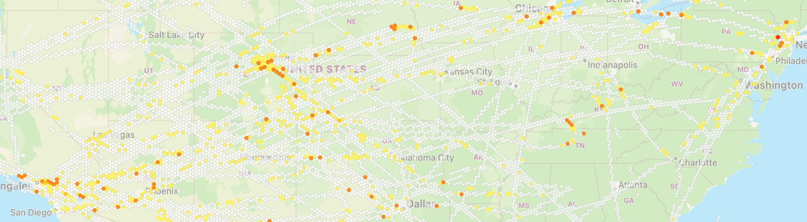

## SkyPath iOS SDK

The world’s leading turbulence and auto-PIREPS data source.<br>
Improve safety and operational efficiency with real-time turbulence information by automatically sensing and sharing accurate, aircraft behaviour via the iPad.

## Contents

- [Description](#description)
- [Requirements](#requirements)
- [Migration Guides](#migration-guides)
- [Installation](#installation)
- [Demo](#demo)
- [Quick Start Guide](https://github.com/Yamasee/skypath-ios-sdk/tree/master/Documentation/Quick%20Start%20Guide.md)
- [Documentation](https://yamasee.github.io/skypath-ios-sdk)
- [License](#license)

## Description

SkyPath iOS SDK enables rapid and seamless integration of SkyPath technology into existing iOS apps. The SDK doesn’t assume anything regarding the app UI, and supplies needed abstraction for SkyPath push and pull server REST API communication, turbulence measurements, and turbulence alerts.

## Requirements

- iOS 13.0+
- Xcode 13.0+
- Swift 5.5+

#### Background Mode

The location can be used while the app is in the background to keep tracking and alert turbulence. <br>
Add `Background Modes` capability in `Signing & Capabilities` and enable `Location updates` mode. <br>
Make sure the  `Privacy - Location When In Use Usage Description` description is provided in the Info.plist of the project. 


## Migration Guides

- [SkyPath 2.0 Migration Guide](https://github.com/Yamasee/skypath-ios-sdk/tree/master/Documentation/SkyPath%202.0%20Migration%20Guide.md)

## Installation

### CocoaPods

[CocoaPods](https://cocoapods.org) is a dependency manager for Cocoa projects. For usage and installation instructions, visit their website. To integrate SkyPath into your Xcode project using CocoaPods, specify it in your `Podfile`:

```ruby
pod 'SkyPath'
```

### Swift Package Manager

The [Swift Package Manager](https://swift.org/package-manager/) is a tool for automating the distribution of Swift code. It’s integrated with the Swift build system to automate the process of downloading, compiling, and linking dependencies.

Use the following to add SkyPath Apple Package Dependency:

```
https://github.com/Yamasee/skypath-ios-sdk
``` 

### Manually

If you prefer not to use either of the aforementioned dependency managers, you can integrate SkyPath into your project manually.

- Download `SkyPathSDK.xcframework`
- Copy `SkyPathSDK.xcframework` to a project directory
- In Xcode project target in `General` tab, in `Frameworks, Libraries, and Embedded Content` tap "Add items", choose a `SkyPathSDK.xcframework` file. Make sure the added framework "Embed" value is set to `Embed & Sign`

## Demo

Try out the `Demo` project inside the repo. You will need just a valid SkyPath API key and enter an airline ICAO and user id in the `ViewController`.



## License

Copyright © Yamasee LTD 2022. All rights reserved. 
See [Terms & Conditions](https://skypath.io/terms/).
