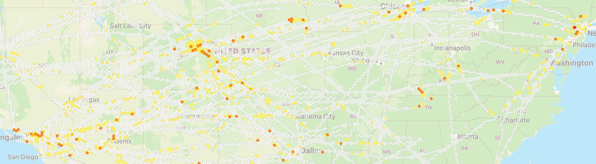

## SkyPath iOS SDK

The world’s leading turbulence and auto-PIREPs data source. 
Improve safety and operational efficiency with real-time turbulence information by automatically sensing and sharing accurate, aircraft behavior via the iPad.

## Description

SkyPath iOS SDK enables rapid and seamless integration of SkyPath technology into existing iOS apps. The SDK doesn’t assume anything regarding the app UI, and supplies needed abstraction for SkyPath push and pull server REST API communication, turbulence measurements, and turbulence alerts.

Check out the [SkyPath iOS SDK Documentation](https://yamasee.github.io/skypath-ios-sdk-docs). 

## Requirements

- iOS 14.0+
- Xcode 15.3+
- Swift 5.10+

## Demo

Try out the Demo project inside the repo. You will need just a valid SkyPath API key and enter an airline ICAO and user id in the `ViewController`.

## License

Copyright © SkyPath LTD 2024. All rights reserved. 
See [Terms & Conditions](https://skypath.io/terms/).
